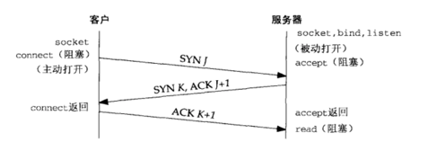
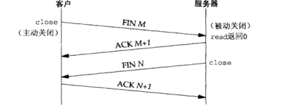
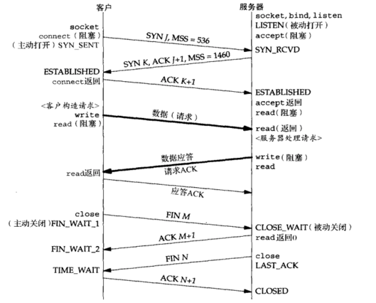
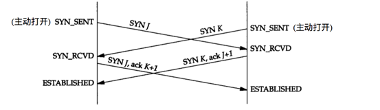
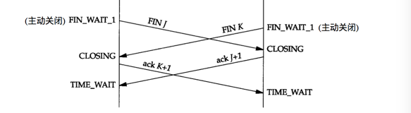

#TCP协议读书笔记

##TCP
###简介
TCP协议是面向连接的，全双工的，可靠的数据流协议（TCP不可被描述成100%可靠的协议，它提供的是数据的可靠递送或故障的可靠通知）；由于TCP是面向连接的所以只能用于端到端的通讯。各种特性如：慢启动，拥塞控制等等。

###TCP连接经典的三次握手（不做解释了）：

###TCP连接终止经典的四次挥手：

终止连接，两端都有可能发起主动关闭，每个方向都需要一个FIN和ACK，某些情形下步骤1的FIN随数据一起发送；另外步骤2和3发送的分节都出自被动关闭一端，有可能被合并成一个分节。
FIN分节的可能由程序调用close发生；也可能是进程自愿退出（调用exit或main函数返回）还有非自愿（收到一个终止本进程的信号，或者断电，宕机等）终止时，所有的描述符都被关闭，也会导致TCP连接上发出一个FIN。

###状态转换

连接：从最初的**CLOSED**状态下执行主动打开，TCP发送一个SYN，客户端新的状态是**SYN_SENT**；服务端收到SYN后变成**SYN_RCVD**状态，如果这个TCP接着接收到一个带ACK的SYN，自己在发送一个ACK，新的状态变为**ESTABLISED**；可以开始传输数据包TCP Segment。

连接终止：如果某个进程调用close，自己转换到**FIN_WAIT_1**状态，对端接收到FIN，从**ESTABLISED**状态转换到**CLOSE_WAIT**状态；同时对端发送FIN的ACK给自己（主动关闭端）状态转换到**FIN_WAIT_2**，同时被动关闭端也发送close，状态变为**LAST_ACK**，自己收到FIN，状态转换到**TIME_WAIT** （这个状态也是面试被问较多的地方，也是网络编程中最不易理解的状态）；其余状态看图。

**TIME_WAIT**状态存在的理由，该状态存在的最长分节生命期为2MSL（RFC建议值2分钟，Berkeley的实现改用30s）在1分钟到4分钟之间，迷途或漫游的重复分组通常由路由器异常引起（路由器崩溃等有可能导致路由循环），在迷途期间，发送端TCO超时重传，重传的分组通过某条正常路径到达目的地，不就迷途的分组也到达目的地，TCP必须正确处理这些重复分组；
**TCP连接在2MSL等待期间，定义这个连接的socket不能再被使用，这个连接只能在2MSL结束后才能再被使用。（某些实现提供避开这个限制的方法。如socket和bind调用之间设置SO_REUSEADDR选项。但TCP原则上避免使用处于2MSL连接中的端口）**

**2MSL存在的两个理由：**
1，可靠地实现TCP全双工连接的终止；
假设最终的ACK丢失。服务端重新发送最终FIN，主动关闭端（客户端）必须维护状态，以重新发送FIN的ACK。要是客户不维护状态信息，将响应RST，服务器端解释成一个错误；如果TCP要正确处理终止某个连接上两个方向的数据流，必须正确处理终止序列的4个分节中任意一个丢失的情况。
2，允许老的重复分组在网络上消逝。
TCP将不给处于**TIME_WAIT**状态的连接发起新的化身，**TIME_WAIT**的持续时间为2MSL，足以让某个方向上的分组最多存活MSL即丢弃，另一方向的应答也最多存活MSL即丢弃；保证成功建立一个TCP连接时，来自先前连接的老的重复分组都已在网络中消逝。（例外，新的SYN序列号大于前一连接的结束序列号，Berkeley实现将当前处于**TIME_WAIT**状态的连接启动新的化身，它要求服务器主动执行关闭，转换为**CLOSE**状态）

**FIN_WAIT_2**状态
如果当另一端进程完成关闭，主动端才会从**FIN_WAIT_2**到**TIME_WAIT**，意味着永远保持这个状态，知道应用层决定进行关闭。很多实现防止这种情况发生，如果主动关闭端进行全关闭而非半关闭，就设置一个定时器，空闲10min 75s，TCP进入CLOSE状态。

###套接字选项（常用的）
####1，SO_REUSEADDR 和 SO_REUSEPORT
（1）SO_REUSEADDR允许启动一个监听服务器并捆绑其众所周知端口，即使以前建立的将本端口用作它们的本地端口的连接仍存在
1，启动一个监听服务器；
2，连接请求到达，派生一个子进程来处理这个客户；
3，监听服务器终止，子进程继续为现有连接服务；
4，重启监听服务器。
默认情况下，监听服务器重新通过调用socket，bind，listen重新启动时，由于它视图bind现有连接的端口，bind会调用失败。如果在socket和bind调用之间设置了SO_REUSEADDR套接字选项，bind会成功。所有的TCP服务器都应该指定本选项，运行服务器在这种情形下重新启动。
（2），SO_REUSEADDR允许同一端口启动同一服务器的多个实例，只要每个实例bind一个不同的本地IP地址。例如主IP：192.168.1.2，有两个别名：192.168.1.28，192.168.1.29。启动3个HTTP服务器，外来bind成功的先决条件是设置SO_REUSEADDR，目的IP：192.168.1.28 port：80的外来请求递送给第二个服务器，目的IP：192.168.1.29 port：80的外来请求递送给第三个服务器，目的port：80的所有其他外来请求递送给默认服务器。**对TCP而言，完全相同的IP和port即使设置了SO_REUSEADDR也会bind失败。这个特性仅支持UDP套接字**
（3），允许单个进程捆绑同一端口到多个套接字，只要每次捆绑不同的本地IP地址即可。
####2，SO_KEEPALIVE
设置保活选项后，如2小时内在该套接字的任意方向上没有数据交换，TCP自动发送一个保活分节，对端必须响应TCP分节。三种情况：
（1），对端以期望的ACK响应；
（2），对端以RST响应，告知本端TCP：对端已崩溃且已重启。该套接字的待处理错误被置为ECONNRESET，套接字本身被关闭。
（3），对端对保活分节没任何响应，Berkeley 的TCP实现另外发送8个分节，两两间隔75s，试图得到一个响应，TCP在发出第一个探测分节后11min15s，则放弃，超时套接字待处理错误置为ETIMEOUT，套接字本身关闭。
**2小时时间太长，全局修改发送间隔可能影响其他系统调用，实际应用中可在应用层提供心博机制来自行判断。** 
####3，SO_LINGER

###边界情况
####1，连接建立的超时（如断开服务器主机的电缆）；
客户端每隔一段时间发送一个SYN，试图建立连接。第2个SYN与第1个间隔5.8s，而第3个与第2个间隔24s。客户端放弃建立连接尝试前SYN重传的时间差值76s，多数Berkeley实现75s。

####2，最大报文段长度MSS
表示TCP传往另一端的最大数据块长度，连接建立时，连接双方通告各自的MSS。一般来说，如果没有分段发生，MSS越大越好（有例外），报文段越大允许每个报文段传输的数据越多，相对IP和TCP首部有更高的网络利用率。对于以太网（局域网）MSS可达1460字节。

####3，TCP的半关闭
TCP提供了连接一端在结束它的发送后还能接受来自另一端数据的能力。

####4，复位报文段RST
1，到不存在的端口的连接请求，目的端口没有进程正在听。对于UDP产生ICMP端口不可达，而TCP使用RST。
2，异常终止一个连接；正常释放，等待正在排队的数据发送完成才发生FIN，异常释放丢弃任何待发送的数据并立即发送RST；RST接收方会区分另一端执行的异常还是正常关闭，SO_LINGER提供这种异常关闭能力。RST报文段不会导致另一端产生任何响应，收到RST的一方根本不确认，将终止该连接，并通知应用层连接复位。
3，检测半打开连接；一方关闭或异常终止连接而另一方不知道，成为半关闭的。异常终止方重启后，TCP的处理原则是 客户继续发送数据， 接收方以RST应答。

####5，同时打开，和同时关闭的情形
1，同时打开，TCP特意设计可以处理同时打开，对于同时打开仅建立一条连接而不是两条。

2，同时关闭，TCP允许同时关闭

###编程实践

###参考
#####1，《UNIX网络编程卷1：套接字联网API》
#####2，《TCP/IP详解，卷1：协议》