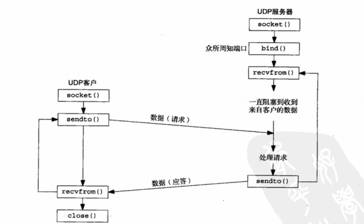
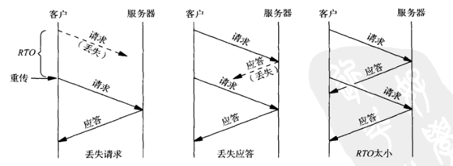

#UDP笔记

###简介
UDP协议提供无连接服务，不可靠的数据报协议，没有像TCP那样的流量控制，重传，保证数据顺序这些特性。适用于一些场合DNS，NFS，SNMP等。

客户端不与服务端建立连接，只管sendto给服务器发送数据报，必须指定服务器地址。类似的服务器不接受客户端的连接，而只是调用recvfrom函数，等待某个客户的数据到达。

###广播和多播

广播和多播仅用于UDP，TCP是面向连接的点对点协议；
广播的用途之一定位本地子网一个服务器主机，也称为资源发现；另一个用途是在有
多个客户主机与单个服务器主机通信的局域网中尽量减少分组流通。

使用广播的问题在于它增加了对广播数据不感兴趣的主机的处理负荷。多播的出现减少了对应用不感兴趣主机的处理负荷。
1，受限的广播地址：255.255.255.255，路由器不转发受限的广播；
2，子网的广播：192.168.43.255 （子网掩码255.255.255），只定向发送广播到这个子网；

在许多情况下，IP多播被证明是一个更好的解决方法；
IP多播提供两类服务：
1，向多个目的地址传送数据；
2，客户对服务器的请求。

###何时用UDP代替TCP
1，对于广播和多播的应用程序必须使用UDP；多媒体的应用，通常意味着UDP的多播；
2，对于简单的请求-应答应用可以使用UDP；不过错误检测（确认，超时和重传）；
3，对于海量数据传输（文件传输）不应该使用UDP。

###如何给UDP增加可靠性
如果想要让请求-应答式应用使用UDP，必须在客户端增加两个特性：
1，超时和重传；用于处理丢失的数据；
2，序列号；供客户验证一个应答是否匹配相应的请求。

#####重传超时的三种情况：
1，请求丢失了；
2，应答丢失了；
3，RTO（重传超时时间）太小；

解决方法：
karn算法解决重传二义性：
1，即使测得一个RTT，也不用它更新估算因子，因为我们不知道其中的应答对应哪次重传的请求；
2，即使应答在重传定时器期满前到达，当前的RTO将继续用于下一个分组。只有当我们收到未重传过的某个请求的一个应答时，才更新RTT估算因子并重新计算RTO。

更精妙的方法：为每个请求冠以一个服务器必须回射的序列号外，还为每个请求冠以一个服务器同样必须回射的时间戳。当收到应答时，我们从当前的时间减去服务器在其应答中回射的时间戳算出RTT。能用该方法算出每个应答的RTT。不再有任何二义性。

[UDP可靠性传输](http://git.oschina.net/yuanhack/sarudp/wikis/Home)
大致和《UNIX网络编程卷1：套接字联网API》描述一致。

###参考
#####1，《UNIX网络编程卷1：套接字联网API》
#####2，《TCP/IP详解，卷1：协议》

