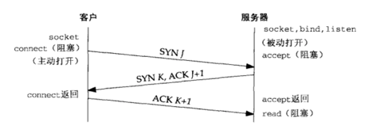
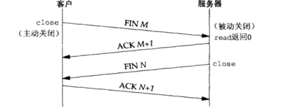
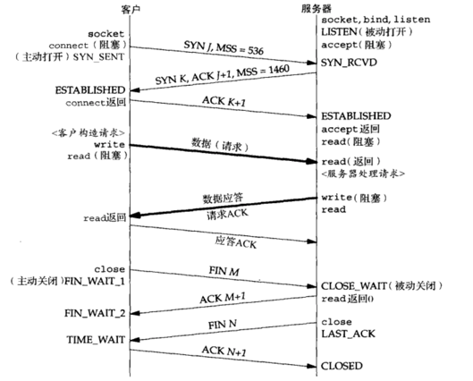

###网络协议笔记

####TCP
#####简介
TCP协议是面向连接的，全双工的，可靠的数据流协议（TCP不可被描述成100%可靠的协议，它提供的是数据的可靠递送或故障的可靠通知）；由于TCP是面向连接的所以只能用于端到端的通讯。各种特性如：慢启动，拥塞控制等等。
#####TCP选项
MSS选项。
窗口规模选项。
时间戳选项。

#####TCP连接经典的三次握手（不做解释了）：

#####TCP连接终止经典的四次挥手：

终止连接，两端都有可能发起主动关闭，每个方向都需要一个FIN和ACK，某些情形下步骤1的FIN随数据一起发送；另外步骤2和3发送的分节都出自被动关闭一端，有可能被合并成一个分节。
FIN分节的可能由程序调用close发生；也可能是进程自愿退出（调用exit或main函数返回）还有非自愿（收到一个终止本进程的信号，或者断电，宕机等）终止时，所有的描述符都被关闭，也会导致TCP连接上发出一个FIN。

#####状态转换

从最初的**CLOSED**状态下执行主动打开，TCP发送一个SYN，客户端新的状态是**SYN_SENT**；服务端收到SYN后变成**SYN_RCVD**状态，如果这个TCP接着接收到一个带ACK的SYN，自己在发送一个ACK，新的状态变为**ESTABLISED**；可以开始传输数据包TCP Segment。

连接终止：如果某个进程调用close，自己转换到**FIN_WAIT_1**状态，对端接收到FIN，从**ESTABLISED**状态转换到**CLOSE_WAIT**状态；同时对端发送FIN的ACK给自己（主动关闭端）状态转换到**FIN_WAIT_2**，同时被动关闭端也发送close，状态变为**LAST_ACK**，自己收到FIN，状态转换到**TIME_WAIT** （这个状态也是面试被问较多的地方，也是网络编程中最不易理解的状态）；其余状态看图。

**TIME_WAIT**状态存在的理由，该状态存在的最长分节生命期为2MSL（RFC建议值2分钟，Berkeley的实现改用30s）在1分钟到4分钟之间，迷途或漫游的重复分组通常由路由器异常引起（路由器崩溃等有可能导致路由循环），在迷途期间，发送端TCO超时重传，重传的分组通过某条正常路径到达目的地，不就迷途的分组也到达目的地，TCP必须正确处理这些重复分组；

**两个理由：**
1，可靠地实现TCP全双工连接的终止；
假设最终的ACK丢失。服务端重新发送最终FIN，主动关闭端（客户端）必须维护状态，以重新发送FIN的ACK。要是客户不维护状态信息，将响应RST，服务器端解释成一个错误；如果TCP要正确处理终止某个连接上两个方向的数据流，必须正确处理终止序列的4个分节中任意一个丢失的情况。
2，允许老的重复分组在网络上消逝。
TCP将不给处于**TIME_WAIT**状态的连接发起新的化身，**TIME_WAIT**的持续时间为2MSL，足以让某个方向上的分组最多存活MSL即丢弃，另一方向的应答也最多存活MSL即丢弃；保证成功建立一个TCP连接时，来自先前连接的老的重复分组都已在网络中消逝。（例外，新的SYN序列号大于前一连接的结束序列号，Berkeley实现将当前处于**TIME_WAIT**状态的连接启动新的化身，它要求服务器主动执行关闭，转换为**CLOSE**状态）

#####考虑同时打开，和同时关闭的情形

#####TCP被人诟病的地方

####UDP

####HTTP，HTTP2
####视频传输相关协议